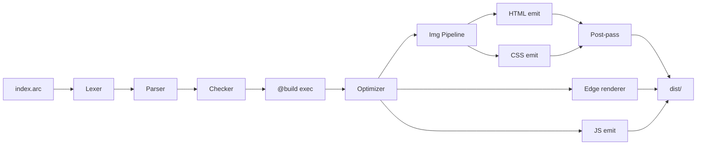

<div align="center">

# Arc

### A new language for the web. Zero dependencies. Zero runtime. Perfect HTML.

<br>

[](#)
[](#)
[](#)
[](#)
[](#)
[](#)
[](#)

<br>

**Write less. Ship faster. Load instantly.**

Arc compiles `.arc` source into hand-tuned HTML, CSS, and JavaScript.
No framework runtime ships to the browser. Ever.

[Why Arc](#-why-arc) • [Quick Start](#-quick-start) • [Syntax](#-syntax-tour) • [Benchmarks](#-benchmarks) • [Architecture](#-architecture) • [Features](#-feature-matrix) • [**Docs**](docs/)

</div>

---

## ⚡ Why Arc

| | React + Next.js | Astro | **Arc** |
|---|:---:|:---:|:---:|
| **Static page (Brotli)** | 200 KB | 1.8 KB | **1.7 KB** |
| **Dashboard client JS** | 225 KB | 0 B† | **225 B** |
| **Build time** | 14 s | 1.5 s | **0.11 s** |
| **Backend req/s (GET /)** | 5,658 | n/a | **56,856** |
| **Runtime deps to install** | hundreds | tens | **zero** |
| **Auto sitemap / `_headers`** | plugin | plugin | **built-in** |
| **Image pipeline (AVIF + WebP)** | plugin | plugin | **built-in** |
| **Edge `@live` rendering** | manual | manual | **built-in** |

<sub>† Astro ships 0 JS only when no client interactivity is present. Arc's 225 B includes a working `@state` tab toggle.</sub>

---

## 🚀 Quick Start

```bash
# Install
npm install -g arc-web

# Create a new project
arc new my-app
cd my-app

# Build
arc build              # one page
arc build-site         # multi-page site

# Develop (with live reload)
arc dev
```

A first page:

```arc
page "Hello, Arc"
  main
    heading "Welcome"
    text "Built from scratch. Zero dependencies. Zero runtime."
```

`arc build` produces:

```
dist/
├── index.html      891 B  ←  ships to the browser
└──                 0 B JS ←  none needed
```

---

## ✍ Syntax Tour

Arc has four block types — `page`, `widget`, `design`, and `import` — and four data contexts: `@build`, `@state`, `@live`, `@realtime`.

### Static page (zero JS)

```arc
page "Blog"
  @build const posts = await fetch("https://cms.example/posts")

  header
    heading "My Blog"
    text "{posts.length} posts"

  main
    for post in posts
      card
        heading "{post.title}"
        text "{post.excerpt}"
```

The compiler fetches `posts` **at build time** and inlines the data into HTML. The browser gets static markup. **Zero JS. Zero runtime fetch.**

### Reactive client state

```arc
page "Counter"
  @state let count = 0

  main
    card
      heading "Counter: {count}"
      row
        button on:click={ @count -= 1 } "−"
        button on:click={ @count += 1 } "+"
      text "Doubled: {count * 2}"
```

Arc emits ~300 bytes of direct DOM-update JS. No virtual DOM, no diff, no framework.

### Edge-rendered dashboard

```arc
page "Dashboard"
  @server fn getUser(id: String) -> { name: String, role: String }
    const r = await fetch("/api/me", { headers: { cookie: @session.cookie } })
    return await r.json()

  @server fn getStats() -> { users: Number, revenue: Number }
    const r = await fetch("/api/stats")
    return await r.json()

  @live let user = getUser("current")
  @live let stats = getStats()

  header
    heading "Welcome back, {user.name}"
  main
    row
      card
        heading "Users"
        text "{stats.users}"
      card
        heading "Revenue"
        text "${stats.revenue}"
```

Arc generates a streaming edge function (Cloudflare Workers / Deno Deploy / Bun / Node). One request → server resolves `@live` in parallel → streams HTML with data inline. **No client fetch, no loading flash.**

### Design vocabulary (compiles to scoped CSS)

```arc
page "Card"
  card "Hello"

  design
    card
      p: 24px
      radius: 12px
      bg: #fff
      shadow: md
      hover: { shadow: lg }
      @mobile { p: 16px }
      @dark { bg: #1a1a1a }
```

Compiles to scoped CSS classes — no specificity wars, no leak. Auto `prefers-reduced-motion`, auto `:focus-visible`, full responsive primitives.

### Image pipeline (built-in)

```arc
page "Hero"
  header
    img src="hero.jpg" alt="Hero"   // → <picture> with AVIF + WebP + JPEG
                                    // → fetchpriority="high" (auto, above-fold)
                                    // → width/height (auto, from image header)
                                    // → dominant-color background fill (auto)
  section
    img src="card.jpg" alt="Card"   // → loading="lazy" decoding="async" (auto, below-fold)
```

No annotations needed. The compiler reads the image at build time, picks formats, generates srcset, classifies above/below fold from AST position.

---

## 📊 Benchmarks

Measured on Linux 6.8 / Node 24 / Chrome 149. Lighthouse mobile profile (Slow 4G + 4× CPU). Brotli level 11. Full data: [`arc-bench/RESULTS.md`](https://github.com/arc-language/arc-web-bench/blob/main/RESULTS.md).

### Static docs site at full SEO parity (1 page, 20 sections)

```
                  Brotli bytes shipped to browser
                  ─────────────────────────────────────────
  Arc          ▇▇                              1,688 B  ← winner
  Vanilla      ▇▇                              1,750 B
  Astro        ▇▇                              1,794 B
  Next.js      ▇▇▇▇▇▇▇▇▇▇▇▇▇▇▇▇▇▇▇▇▇▇▇▇▇    200,000 B
```

| Stack    | Lighthouse | LCP    | FCP    | Brotli  | Build  |
| -------- | :--------: | -----: | -----: | ------: | -----: |
| **Arc**  |  **100**   | **901 ms** | **812 ms** | **1.7 KB** | **0.11 s** |
| Vanilla  |    100     | 1051 ms | 901 ms | 1.7 KB  | 0.02 s |
| Astro    |    100     |  901 ms | 870 ms | 1.8 KB  | 1.47 s |
| Next.js  |     93     | 3148 ms | 1038 ms | 200 KB | 14.05 s |

### Dynamic dashboard with real 50 ms API latency

```
                  Largest Contentful Paint
                  ─────────────────────────────
  Arc          ▇▇▇▇▇▇▇▇                  804 ms ← winner (tie)
  Astro        ▇▇▇▇▇▇▇▇                  804 ms
  Vanilla      ▇▇▇▇▇▇▇▇▇                 905 ms  (ships empty shell)
  Next.js      ▇▇▇▇▇▇▇▇▇▇▇▇▇▇▇▇▇        1657 ms
```

| Stack    | LCP    | FCP    | Client JS (Brotli) |
| -------- | -----: | -----: | -----------------: |
| **Arc**  | **804 ms** | **645 ms** | **225 B**          |
| Astro    | 804 ms | 677 ms |  0 B (no interactivity) |
| Vanilla  | 905 ms | 905 ms | 340 B              |
| Next.js  | 1657 ms | 662 ms | 193 KB             |

### Multi-page docs (20 routes, per page)

```
                  Brotli bytes per page (cold cache)
                  ──────────────────────────────────────
  Vanilla      ▇▇▇▇▇▇                     992 B
  Arc          ▇▇▇▇▇▇                   1,021 B  ← within 29 B of Vanilla
  Astro        ▇▇▇▇▇▇▇▇▇                1,475 B
  Next.js      ▇▇▇▇▇▇▇▇▇▇▇▇▇▇▇▇▇▇▇      3,176 B  (+ 225 KB framework)
```

### Build time (median of 3 runs)

```
  Arc           0.11 s   ▮
  Astro         1.47 s   ▮▮▮▮▮▮▮▮▮▮▮▮▮
  Next.js      14.05 s   ▮▮▮▮▮▮▮▮▮▮▮▮▮▮▮▮▮▮▮▮▮▮▮▮▮▮▮▮▮▮▮▮▮▮▮▮▮▮▮▮▮▮▮▮▮▮▮▮▮▮▮▮▮▮▮▮▮▮▮▮▮▮▮▮▮▮▮▮▮▮▮▮▮▮▮▮▮▮▮▮▮▮▮▮▮▮▮▮▮▮▮▮▮▮▮▮▮▮▮▮▮▮▮▮▮▮▮▮▮▮▮▮▮▮▮▮▮▮▮▮▮▮▮▮▮▮▮▮▮▮▮▮▮▮▮▮▮▮▮▮▮▮▮▮▮▮
```

**Arc is 10–250× faster to build than its competitors.**

### Full-stack server throughput (HTML page + JSON API, same process)

Measured on Linux 6.8 / Bun 1.x / Node.js 24. autocannon: 100 connections, 10 s, pipelining=1.

#### GET / — pre-compiled static HTML

```
                  requests/second (higher is better)
                  ───────────────────────────────────────────────────────────
  Arc lean     ▇▇▇▇▇▇▇▇▇▇▇▇▇▇▇▇▇▇▇▇▇▇▇▇▇▇▇▇▇▇▇▇▇▇▇▇▇▇▇▇▇▇▇▇▇▇   56,856  ← winner
  Elysia (Bun) ▇▇▇▇▇▇▇▇▇▇▇▇▇▇▇▇▇▇▇▇▇▇▇                          30,351
  Hono (Bun)   ▇▇▇▇▇▇▇▇▇▇▇▇▇▇▇▇▇▇▇▇▇▇▇                          29,992
  Fastify      ▇▇▇▇▇▇▇▇▇▇▇▇▇▇▇▇▇▇▇                               24,345
  Next.js      ▇▇▇▇▇                                               5,658
```

#### POST /api/echo — JSON request/response

```
                  requests/second (higher is better)
                  ───────────────────────────────────────────────────────────
  Arc lean     ▇▇▇▇▇▇▇▇▇▇▇▇▇▇▇▇▇▇▇▇▇▇▇▇▇▇▇▇▇▇▇▇▇▇                41,178  ← winner
  Hono (Bun)   ▇▇▇▇▇▇▇▇▇▇▇▇▇▇▇▇▇▇▇▇▇▇▇▇▇▇▇▇▇▇▇▇                  38,717
  Elysia (Bun) ▇▇▇▇▇▇▇▇▇▇▇▇▇▇▇▇▇▇▇▇▇▇▇▇▇▇▇▇                      33,398
  Fastify      ▇▇▇▇▇▇▇▇▇▇▇▇▇▇▇                                    17,420
  Next.js      ▇▇▇▇                                                 4,032
```

| Framework | GET / | POST /echo | p99 GET / | p99 POST |
| --- | ---: | ---: | ---: | ---: |
| **Arc lean (Bun)** | **56,856** | **41,178** | **5 ms** | **6 ms** |
| Hono (Bun) | 29,992 | 38,717 | 9 ms | 5 ms |
| Elysia (Bun) | 30,351 | 33,398 | 11 ms | 9 ms |
| Fastify (Node) | 24,345 | 17,420 | 9 ms | 16 ms |
| Next.js (Node) | 5,658 | 4,032 | 70 ms | 53 ms |

Arc's `GET /` is **pre-compiled to a `Response` constant at build time** — zero per-request HTML work.
The POST echo path uses **raw `ArrayBuffer` passthrough** — zero JSON parse/stringify.

---

## 🏛 Architecture

```
                         ┌──────────────────┐
                         │   index.arc      │
                         └─────────┬────────┘
                                   │
                  ┌────────────────┼────────────────┐
                  ▼                ▼                ▼
              ┌───────┐       ┌───────┐       ┌───────┐
              │ Lexer │  ──▶  │Parser │  ──▶  │  AST  │
              └───────┘       └───────┘       └───┬───┘
                                                  │
                  ┌───────────────────────────────┼───────────────────────────────┐
                  ▼                               ▼                               ▼
            ┌──────────┐                   ┌──────────┐                    ┌──────────┐
            │ @build   │                   │ Optimizer│                    │  Checker │
            │ executor │                   │  (DCE,   │                    │  (types, │
            │ (fetch,  │                   │  unroll, │                    │   a11y,  │
            │  readFile│                   │  inline) │                    │   etc.)  │
            └─────┬────┘                   └─────┬────┘                    └──────────┘
                  │                              │
                  └────────────┬─────────────────┘
                               ▼
                ┌──────────────────────────────┐
                │      Image Pipeline           │
                │  (sharp: AVIF/WebP/JPEG,      │
                │   layout-aware srcset,        │
                │   above-fold detection,       │
                │   dominant color, dedup)      │
                └──────────────┬───────────────┘
                               │
              ┌────────────────┼────────────────┬─────────────────┐
              ▼                ▼                ▼                 ▼
          ┌───────┐        ┌───────┐        ┌───────┐         ┌─────────┐
          │ HTML  │        │  CSS  │        │  JS   │         │  Edge   │
          │emitter│        │emitter│        │emitter│         │renderer │
          └───┬───┘        └───┬───┘        └───┬───┘         └────┬────┘
              │                │                │                  │
              └──────┬─────────┘                │                  │
                     ▼                          │                  │
              ┌────────────┐                    │                  │
              │ Post-Pass  │                    │                  │
              │ (CSS dedup,│                    │                  │
              │  minify,   │                    │                  │
              │  critical, │                    │                  │
              │  prefetch, │                    │                  │
              │  view-tx)  │                    │                  │
              └─────┬──────┘                    │                  │
                    ▼                           ▼                  ▼
              ┌──────────────────────────────────────────────────────────┐
              │  dist/                                                    │
              │  ├── *.html         (per page, minified)                  │
              │  ├── shared.<sha>.css   (multi-page CSS dedup)            │
              │  ├── app.js         (only if @state used)                 │
              │  ├── *.{avif,webp,jpg}  (content-hashed image variants)   │
              │  ├── sitemap.xml    (auto-generated from canonical meta)  │
              │  ├── robots.txt     (auto-generated)                      │
              │  ├── _headers       (Cloudflare/Netlify cache + CSP)      │
              │  └── _arc/                                                 │
              │      ├── functions.js   (@server edge functions)          │
              │      └── renderer.js    (@live streaming edge worker)     │
              └──────────────────────────────────────────────────────────┘
```

---

## 🧩 Feature Matrix

### Language

| Feature | Status |
| --- | :---: |
| `page`, `widget`, `design`, `import` blocks | ✅ |
| `@build` — compile-time data inlining (fetch, readFile, JSON, ...) | ✅ |
| `@state` — reactive client variables with direct DOM updates | ✅ |
| `@computed` — derived values, recomputed only when deps change | ✅ |
| `@live` — edge-rendered server values, streamed in initial HTML | ✅ |
| `@realtime` — WebSocket/SSE channels with auto-reconnect | ✅ |
| `@server` — auto-deployed edge functions, called from client via ADP binary | ✅ |
| `@worker` — Web Worker background tasks | ✅ |
| `match`, `for ... in`, `unless`, `until`, pipeline operator | ✅ |
| Exhaustive pattern matching with type guards | ✅ |
| No `var`, no `null` (only `none`), strict `==` only | ✅ |
| `bind:value`, `on:click` reactive attributes | ✅ |

### Output

| Feature | Status |
| --- | :---: |
| HTML emission with semantic tags + scoped CSS classes | ✅ |
| CSS scoping via per-component hash | ✅ |
| Tree-shaken base utility classes (only emit when referenced) | ✅ |
| Critical CSS inlining (below 14 KB threshold) | ✅ |
| CSS minification (whitespace, comments, `;}`) | ✅ |
| HTML minification (whitespace between tags) | ✅ |
| Multi-page shared CSS dedup (`arc build-site`) | ✅ |
| Direct DOM update JS (no VDOM, no framework) | ✅ |
| ADP binary protocol (3× smaller, 10× faster decode than JSON) | ✅ |
| Source maps for `.arc` source | ✅ |
| HTML streaming for `@live` (head flushed before data resolves) | ✅ |

### SEO + Production

| Feature | Status |
| --- | :---: |
| Open Graph + Twitter Card meta auto-emission | ✅ |
| JSON-LD structured data (`Article`, `WebSite`, etc.) | ✅ |
| Canonical, robots, keywords, author meta | ✅ |
| Auto `sitemap.xml` (from canonical meta + lastmod/priority/changefreq) | ✅ |
| Auto `robots.txt` (with sitemap reference) | ✅ |
| Auto `_headers` manifest (Cloudflare Pages / Netlify) | ✅ |
| `Link:` preload header for shared CSS (enables 103 Early Hints) | ✅ |
| `Cache-Control: immutable` for content-hashed assets | ✅ |
| CSP delivered via header when `_headers` present | ✅ |
| `<link rel="prefetch">` for same-site `<a>` targets (multi-page) | ✅ |
| `<meta name="view-transition" content="same-origin">` injection | ✅ |
| Skip-link + sr-only utilities (a11y default, tree-shaken when unused) | ✅ |
| `prefers-reduced-motion` honored globally | ✅ |
| Auto `aria-*`, `loading="lazy"`, `decoding="async"`, `fetchpriority="high"` | ✅ |

### Image pipeline

| Feature | Status |
| --- | :---: |
| Build-time AVIF + WebP + original transcoding (via `sharp`) | ✅ |
| Smart format selection (auto-drop AVIF when not 20% smaller than WebP) | ✅ |
| `meta.imageFormats = ["webp","jpg"]` opt-out | ✅ |
| Layout-aware srcset (only widths the design actually needs) | ✅ |
| AST-derived above-the-fold detection (auto `fetchpriority="high"`) | ✅ |
| Dominant-color background fill (no gray flash during load) | ✅ |
| Content-hash dedup (same logo across 20 pages → one file) | ✅ |
| Graceful fallback when `sharp` is not installed | ✅ |

### Edge runtime

| Feature | Status |
| --- | :---: |
| Cloudflare Workers (WinterCG fetch handler) | ✅ |
| Deno Deploy | ✅ |
| Bun HTTP server | ✅ |
| Node.js HTTP server | ✅ |
| Parallel `@live` resolution via `Promise.all` | ✅ |
| Streaming `Response(ReadableStream)` — head flushed before data | ✅ |
| `@session` context, validated at edge boundary | ✅ |
| Security headers (CSP, X-Frame-Options, Referrer-Policy, etc.) | ✅ |

---

## 🧠 The Four Data Contexts

Every piece of data in a web app has an execution context. Arc names all four:

```
┌─────────────┬────────────────────────────────────────────────────────────┐
│ @build      │  COMPILE-TIME — runs once during `arc build`, data inlined  │
│             │  into HTML. Zero runtime cost. Zero server cost.             │
│             │  Use for: blog posts, docs content, marketing copy.          │
├─────────────┼────────────────────────────────────────────────────────────┤
│ @state      │  CLIENT — lives in the browser, direct DOM updater on        │
│             │  change. Works offline. Zero server cost.                    │
│             │  Use for: form state, UI toggles, counters, local prefs.     │
├─────────────┼────────────────────────────────────────────────────────────┤
│ @live       │  EDGE — rendered server-side at request time, streamed as   │
│             │  HTML. One round trip total. No flash of empty content.     │
│             │  Use for: user dashboards, personalized pages, auth-gated.  │
├─────────────┼────────────────────────────────────────────────────────────┤
│ @realtime   │  STREAM — WebSocket/SSE channel, live updates pushed to     │
│             │  the DOM via ADP binary frames. Auto-reconnect handled.     │
│             │  Use for: chat, collaborative editing, live feeds.          │
└─────────────┴────────────────────────────────────────────────────────────┘
```

Every React hook, every Next.js data function, every tRPC call — all of them fall into one of these four buckets. Arc just names them.

---

## 📦 Project Structure

```
arc/
├── src/
│   ├── cli.js              # build, build-site, dev, check, new, deploy commands
│   ├── lexer.js            # tokenizer
│   ├── parser.js           # recursive descent → AST
│   ├── checker.js          # semantic + a11y checks
│   ├── build-exec.js       # @build evaluation (fetch, readFile, etc.)
│   ├── optimizer.js        # dead code elimination, static folding
│   ├── img-pipeline.js     # image transcoding + smart format selection
│   ├── post.js             # critical CSS, minification, resource hints
│   ├── emitters/
│   │   ├── html.js
│   │   ├── css.js
│   │   ├── js.js                       # direct DOM updater emitter
│   │   ├── server.js                   # @server fn → edge function
│   │   ├── site-meta.js                # sitemap.xml + robots.txt
│   │   └── headers-manifest.js         # _headers (Cloudflare/Netlify)
│   ├── edge/renderer.js                # @live streaming edge worker generator
│   └── realtime/client.js              # @realtime WebSocket client generator
├── adp/
│   ├── encoder.js          # Arc Data Protocol — server-side
│   └── decoder.js          # ADP decoder — browser, < 1 KB gzipped
├── stdlib/                 # Arc standard library (written in Arc)
├── examples/
│   ├── hello/              # static page, 0 JS
│   ├── counter/            # @state reactive
│   ├── blog/               # @build data inlining
│   ├── dashboard/          # @server functions
│   ├── live/               # @live edge rendering
│   ├── chat/               # @realtime WebSocket
│   └── patterns/           # native patterns (modal, tooltip, accordion)
└── tests/                  # 1071 tests, 95.85% line coverage
```

---

## 🔬 Compile Pipeline



---

## 🎯 Design Principles

1. **Zero runtime cost.** No framework ships to the browser. The compiler does the work once; the user pays nothing per visit.
2. **The compiler sees everything.** Knowing the full program at build time enables optimizations no runtime framework can match (perfect tree-shaking, dependency graph, critical CSS, image format choice).
3. **Defaults that are correct, not safe.** `prefers-reduced-motion` on. Skip links on. CSP on. `loading="lazy"` on below-fold images. Opt out per page, not opt in.
4. **Boring output.** Arc emits HTML/CSS/JS that any browser, screen reader, SEO crawler, or browser DevTools understands. No WASM, no canvas, no custom protocol.
5. **No dependencies.** Arc's runtime deps are zero. The compiler itself is pure Node — `sharp` is the only optional dep for the image pipeline.

---

## 📚 Examples

| Example | Demonstrates | Output |
|---|---|---|
| [`examples/hello`](examples/hello) | Static page, semantic HTML | 891 B HTML, 0 JS |
| [`examples/counter`](examples/counter) | `@state` reactivity | 478 B HTML, 474 B JS |
| [`examples/blog`](examples/blog) | `@build` data inlining | All posts inline, 0 JS |
| [`examples/dashboard`](examples/dashboard) | `@server` + ADP binary | Edge function + 225 B client |
| [`examples/live`](examples/live) | `@live` streaming render | Pre-rendered HTML, no flash |
| [`examples/chat`](examples/chat) | `@realtime` WebSocket | Binary frames, auto-reconnect |
| [`examples/patterns`](examples/patterns) | Native modal/tooltip/accordion | 0 JS using `<dialog>`/Popover API |

---

## 🔧 CLI Reference

```bash
arc build [dir]            # Single-page build → dist/index.html
arc build-site [dir]       # Multi-page build with shared CSS, sitemap, _headers
arc build-server [dir]     # Full-stack Bun server → dist/server.js
arc build-server --watch   # Rebuild on any .arc change (hot server dev)
arc dev [dir]              # Watch mode with live reload
arc check [files…]         # Type + a11y check without emitting
arc new <name>             # Scaffold a project (--template default|counter|blog)
arc deploy [dir] [--target cloudflare|deno|bun|node]
```

---

## 🤖 LLM Integration

Arc is the first web framework with first-class LLM tooling: a 22-skill bundle that works with Claude Code, Cursor, Cline, Aider, Continue, GitHub Copilot, ChatGPT, Claude.ai, and any other code-aware LLM.

Every authoring skill ends with a **universal verification checklist** (`arc-self-verify`) covering: simplicity, time/space complexity, Core Web Vitals impact, bundle bytes, reversibility, accessibility, and type safety.

| Tool | Install command |
| --- | --- |
| **Claude Code** | works automatically — skills ship at `.claude/skills/` in this repo |
| **Cursor** | `cp node_modules/arc-web/editor-extensions/llm-skills/all.md .cursorrules` |
| **Cline / VS Code** | paste `all.md` into Cline → Settings → Custom Instructions |
| **Aider** | `aider --read node_modules/arc-web/editor-extensions/llm-skills/all.md` |
| **Continue.dev** | reference in `~/.continue/config.json` system message |
| **GitHub Copilot** | `cp ... .github/copilot-instructions.md` |
| **ChatGPT / Claude.ai** | paste `all.md` into Custom Instructions / Project knowledge |

Full integration guides: [`editor-extensions/llm-skills/INSTALL/`](editor-extensions/llm-skills/INSTALL/).
Skill catalog: [`editor-extensions/llm-skills/SKILLS.md`](editor-extensions/llm-skills/SKILLS.md).
Single-file bundle (128 KB / ~32K tokens): [`editor-extensions/llm-skills/all.md`](editor-extensions/llm-skills/all.md).

## 📖 Full Documentation

Extensive reference + recipes + internals at [`docs/`](docs/). Highlights:

- **Onramp**: [Installation](docs/getting-started/installation.md) → [Your First Page](docs/getting-started/first-page.md) → [Core Concepts](docs/getting-started/concepts.md)
- **Language reference**: [Syntax with EBNF](docs/language/syntax.md), [Data Contexts](docs/language/data-contexts.md), [Design Vocabulary](docs/language/design-vocabulary.md)
- **Migration guides**: [from React](docs/guides/migrating-from-react.md), [from Astro](docs/guides/migrating-from-astro.md), [from Vanilla HTML](docs/guides/migrating-from-vanilla.md)
- **Recipes**: [Auth Flow](docs/recipes/auth-flow.md), [Forms](docs/recipes/forms.md), [Routing](docs/recipes/routing.md), [Dark Mode](docs/recipes/dark-mode.md), [API Fetching](docs/recipes/api-fetching.md)
- **For LLMs**: [`docs/llms.txt`](docs/llms.txt) (index) or [`docs/llms-full.txt`](docs/llms-full.txt) (all docs concatenated)

## 🤝 Contributing

Arc is small (~5,200 lines of pure Node, zero deps). Every PR runs:
- 1,150 tests with the built-in Node test runner
- 95.85% line coverage, 86.52% branch, 91.59% function
- Lighthouse-100 verification on the example sites

Read [Contributing](docs/internals/contributing.md) for the workflow.

---

## 📄 License

MIT. See [LICENSE](LICENSE).

---

<div align="center">
<sub>
<strong>Built from scratch.</strong> Zero dependencies. Zero runtime. Perfect HTML.<br>
Made with ☕ and a strong dislike of 225 KB JavaScript bundles.
</sub>
</div>
